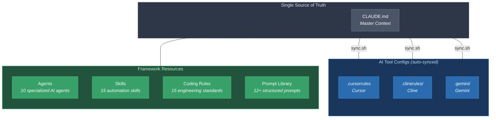
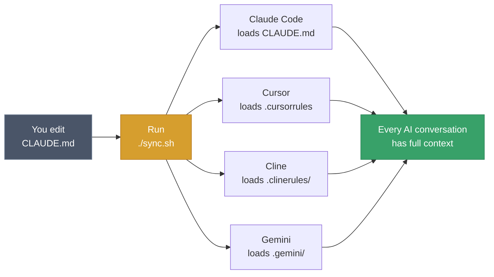

# Future-Proof AI Automation

A production-grade framework for AI-powered development — pre-built agents, reusable skills, coding standards, and a structured prompt library that works across **Claude Code, Cursor, Cline, and Gemini**.

Built for developers, educators, and teams who want their AI tools to have consistent, high-quality context from the first message.

---

## Architecture Overview



**The idea is simple:** Edit one file (`CLAUDE.md`), run `./sync.sh`, and every AI tool you use gets the same context — your stack, your standards, your agents, your skills.

---

## How It Works



---

## What's Inside

```
.
├── CLAUDE.md                     # Master context (source of truth)
├── .cursorrules                  # Cursor (synced)
├── .clinerules/                  # Cline (synced)
├── .gemini/                      # Gemini (synced)
│
├── prompts/                      # Structured prompt library
│   ├── PROMPT_INDEX.md           # Browse all prompts
│   ├── automation/               # n8n, webhooks, batch processing
│   ├── coding/                   # CRUD gen, code review, debugging
│   ├── content/                  # YouTube scripts, LinkedIn, courses
│   ├── research/                 # Tech comparison, market research
│   └── templates/                # Template for creating new prompts
│
├── student-starter-kit/          # Distributable kit
│   ├── agents/                   # 10 AI agent definitions
│   ├── skills/                   # 15 automation skills
│   ├── coding-rules/             # 15 engineering standards + docs
│   └── README.md                 # Setup guide
│
├── sync.sh                       # Sync master context to all tools
└── README.md                     # You are here
```

---

## Agents

10 specialized AI agents that can be spawned for specific tasks.

| Agent | Specialization |
|-------|---------------|
| **backend-builder** | FastAPI, Python, PostgreSQL APIs |
| **frontend-builder** | Next.js, React, Tailwind UI |
| **code-reviewer** | Bug & security review with PASS/FAIL verdict |
| **test-runner** | Run tests, write missing tests |
| **deployer** | Vercel, AWS, Docker, CI/CD |
| **db-architect** | Schema design, migrations, RLS |
| **mcp-builder** | Build MCP servers for any API |
| **api-integrator** | OAuth, webhooks, REST/GraphQL |
| **security-auditor** | OWASP Top 10, secrets, injection audit |
| **researcher** | Codebase exploration, deep investigation |

---

## Skills

15 reusable automation skills, each with a `SKILL.md` containing step-by-step instructions.

| Category | Skills |
|----------|--------|
| **Content & Media** | video-edit, image-to-video, nano-banana-images, handdrawn-diagram, excalidraw-diagram, excalidraw-visuals, gamma-presentation |
| **Infrastructure** | modal-deploy, add-webhook, local-server, design-website |
| **Browser & Voice** | ghost-browser, whisper-voice |
| **Security & Meta** | guardrail-pipeline, skill-builder |

---

## Prompt Library

Structured, reusable prompts with metadata, variables, and examples. Every prompt follows a standard template:

```yaml
---
name: Prompt Name
category: coding | automation | content | research
difficulty: beginner | intermediate | advanced
tags: [relevant, tags]
---
# The Prompt
# Variables: {{PLACEHOLDER}} syntax
# Example usage included
```

**12 starter prompts** across 4 categories — see [`prompts/PROMPT_INDEX.md`](prompts/PROMPT_INDEX.md) for the full list.

To add your own:
```bash
cp prompts/templates/PROMPT_TEMPLATE.md prompts/coding/my-prompt.md
# Edit it, then add an entry to prompts/PROMPT_INDEX.md
```

---

## Coding Rules

15 production-grade engineering standards covering:

| Area | Rules |
|------|-------|
| **Architecture** | Clean architecture, separation of concerns |
| **Backend** | FastAPI patterns, Pydantic validation, async I/O |
| **Frontend** | Next.js, TypeScript, server components |
| **Database** | PostgreSQL migrations, indexes, transactions |
| **API Design** | Versioning, typed schemas, consistent errors |
| **Security** | No hardcoded secrets, input validation, prompt injection resistance |
| **Testing** | Critical path tests, deterministic units, mocked externals |
| **DevOps** | Docker, CI/CD, rollback-safe deployments |

Use them all or pick what you need with the compose script:
```bash
cd student-starter-kit/coding-rules/claude
./compose.sh 00 10 30 70 80 99 > ~/your-project/CLAUDE.md
```

---

## Quick Start

### 1. Clone

```bash
git clone https://github.com/aiagentwithdhruv/Euron-Future-Proof-Automation.git
cd Euron-Future-Proof-Automation
```

### 2. Open in your AI tool

| Tool | What happens |
|------|-------------|
| **Claude Code** | `CLAUDE.md` loads automatically |
| **Cursor** | `.cursorrules` loads automatically |
| **Cline** | `.clinerules/` loads automatically |
| **Gemini** | Reference `.gemini/context.md` |

### 3. Use agents and skills

```
> Use the backend-builder agent to create a FastAPI CRUD API
> Use the video-edit skill to add captions to my video
> Use the code-reviewer agent to review my changes
```

### 4. Keep everything in sync

After editing `CLAUDE.md`:
```bash
./sync.sh
```

---

## Default Tech Stack

| Layer | Technology |
|-------|-----------|
| Backend | FastAPI (Python) |
| Frontend | Next.js + React + Tailwind CSS |
| Database | PostgreSQL / Supabase |
| AI | Claude, OpenAI, Gemini APIs |
| Deployment | Vercel, Modal, AWS |
| Automation | n8n, MCP |

---

## Contributing

1. Fork this repo
2. Add your prompts, agents, or skills
3. Run `./sync.sh` to keep configs in sync
4. Submit a PR

---

## License

MIT
